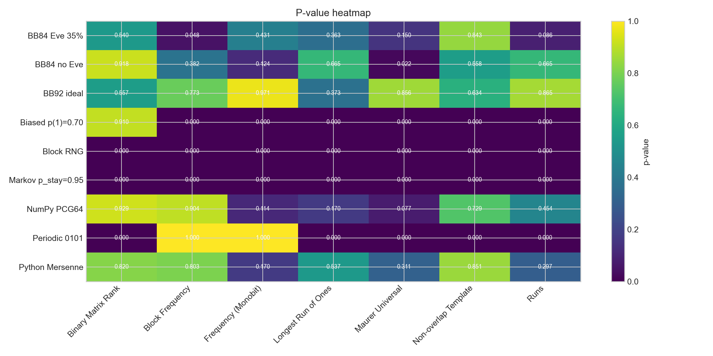
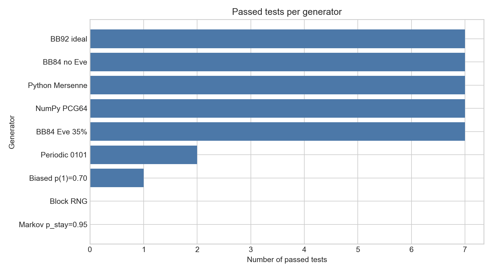

# Statistical Test Battery for Random Number Generators

An academic Python project for generating binary sequences and evaluating their statistical quality with a seven-test battery inspired by **NIST SP 800-22**. The study compares established pseudorandom generators, deliberately flawed controls, and efficient BB84/BB92-inspired bit sources.

> **Scope:** BB84 and BB92 are used as quantum-inspired sources of bits. This project evaluates the resulting sequences; it is not a complete implementation or security proof of either quantum key-distribution protocol.

## Quick grading guide

| What to review | Location |
| --- | --- |
| Main experiment and configuration | [`rng_battery_project/main.py`](rng_battery_project/main.py) and [`src/config.py`](rng_battery_project/src/config.py) |
| Random-number generators | [`src/generators/`](rng_battery_project/src/generators) |
| Statistical-test implementations | [`src/tests/`](rng_battery_project/src/tests) |
| Analysis and plotting pipeline | [`src/analysis/`](rng_battery_project/src/analysis) |
| Generated written report | [`rng_battery_report.md`](rng_battery_project/results/reports/rng_battery_report.md) |
| Complete numerical results | [`results/tables/`](rng_battery_project/results/tables) |
| Generated visualizations | [`results/figures/`](rng_battery_project/results/figures) |
| Exploratory notebook | [`exploratory_analysis.ipynb`](rng_battery_project/notebooks/exploratory_analysis.ipynb) |

The entire analysis is reproducible with one command. A fixed base seed (`20260527`) is used so the submitted results can be regenerated.

## Research question

Can a compact statistical test battery distinguish plausible random bit streams from sources with known defects, and how do classical pseudorandom generators compare with BB84/BB92-inspired simulated sources?

The project also examines two supporting questions:

1. How does sequence length affect the stability of test outcomes?
2. How does simulated BB84 intercept-resend eavesdropping affect QBER, and is that disturbance visible to general randomness tests?

## Methodology

Each generator produces a binary sequence of 200,000 bits for the main experiment. Every sequence is evaluated at a significance level of **α = 0.01** using:

1. Frequency (Monobit)
2. Block Frequency
3. Runs
4. Longest Run of Ones
5. Binary Matrix Rank
6. Non-overlapping Template Matching
7. Maurer's Universal Statistical Test

The comparison includes:

- **Classical PRNGs:** NumPy PCG64 and Python's Mersenne Twister.
- **Negative controls:** biased Bernoulli, periodic, constant-block, and highly persistent Markov sources.
- **Quantum-inspired sources:** efficient BB84 simulation with and without Eve, plus an idealized BB92 simulation.

Each test returns its statistic, p-value, pass/fail decision, significance level, execution time, and diagnostic details. Additional analyses calculate Shannon entropy and autocorrelation, sweep sequence lengths from 1,000 to 100,000 bits, and sweep the simulated BB84 Eve fraction.

## Main results

The submitted reproducible run produced the following summary:

| Generator | Tests passed | Pass rate | Minimum p-value |
| --- | ---: | ---: | ---: |
| BB92 ideal | 7/7 | 100% | 0.3733 |
| BB84 no Eve | 7/7 | 100% | 0.0222 |
| Python Mersenne Twister | 7/7 | 100% | 0.1698 |
| NumPy PCG64 | 7/7 | 100% | 0.0768 |
| BB84, Eve at 35% | 7/7 | 100% | 0.0476 |
| Periodic `0101` | 2/7 | 28.6% | 0.0000 |
| Biased, P(1) = 0.70 | 1/7 | 14.3% | 0.0000 |
| Block source | 0/7 | 0% | 0.0000 |
| Markov, P(stay) = 0.95 | 0/7 | 0% | 0.0000 |

These outcomes show that the battery accepts the five plausible sources in this run while strongly rejecting the deliberately defective controls. The BB84 simulation with 35% interception produced a QBER of approximately **8.77%**, compared with 0% in the no-Eve simulation, but its output still passed the randomness tests. This illustrates an important distinction: **QBER measures protocol disturbance, whereas this battery measures statistical properties of a single bit sequence.**





## Reproduce the project

### Requirements

- Python 3.10 or newer recommended
- `pip`

### Setup and run

From the repository root:

```bash
cd rng_battery_project
python -m venv .venv
```

Activate the environment:

```bash
# Windows PowerShell
.venv\Scripts\Activate.ps1

# macOS/Linux
source .venv/bin/activate
```

Install dependencies and execute the complete pipeline:

```bash
python -m pip install -r requirements.txt
python main.py
```

The command regenerates the CSV/JSON tables, Markdown report, and PNG figures under `rng_battery_project/results/`. It prints a compact result summary when finished.

To inspect the exploratory notebook:

```bash
jupyter notebook notebooks/exploratory_analysis.ipynb
```

## Configuration

The main parameters are defined in [`src/config.py`](rng_battery_project/src/config.py):

```python
ALPHA = 0.01
SEQUENCE_LENGTH = 200_000
BASE_SEED = 20260527
```

Optional analyses are controlled near the top of [`main.py`](rng_battery_project/main.py):

```python
RUN_LENGTH_SWEEP = True
RUN_EVE_SWEEP = True
RUN_ENTROPY_ANALYSIS = True
RUN_QISKIT_DEMO = False
```

Qiskit is intentionally optional and is not included in `requirements.txt`. To generate the small circuit demonstrations, install Qiskit separately and set `RUN_QISKIT_DEMO = True`. The large statistical experiment uses efficient classical simulation and does not require Qiskit.

## Project structure

```text
KK/
├── README.md                         # Repository overview and grading guide
└── rng_battery_project/
    ├── main.py                       # End-to-end experiment runner
    ├── requirements.txt              # Required Python packages
    ├── notebooks/
    │   └── exploratory_analysis.ipynb
    ├── src/
    │   ├── analysis/                 # Battery runner, statistics, sweeps, plots
    │   ├── generators/               # Classical, flawed, BB84, and BB92 sources
    │   ├── tests/                    # Seven statistical tests
    │   └── config.py                 # Seed, sequence length, and output paths
    └── results/
        ├── figures/                  # Generated plots
        ├── reports/                  # Generated Markdown report
        └── tables/                   # Detailed and summarized results
```

## Interpretation and limitations

- A p-value below α causes rejection for that test; a passing p-value does not prove that a source is truly random.
- Multiple tests on one finite sequence are evidence, not a formal security guarantee or certification.
- The implementations are **inspired by and adapted from** NIST SP 800-22; this repository is not a drop-in replacement for the official NIST Statistical Test Suite.
- Fixed seeds support reproducibility but do not characterize every possible output of a generator. A larger study would evaluate many independently seeded sequences and analyze pass proportions.
- High Shannon entropy alone is insufficient. For example, the periodic `0101` source is perfectly balanced yet predictable; its autocorrelation and structure-sensitive test results reveal the defect.
- The BB84/BB92 models are efficient simulations designed to supply long bit streams. They do not model all physical noise, device imperfections, reconciliation, privacy amplification, or finite-key security effects.

## Extending the work

- To add a generator, implement a function that returns a one-dimensional NumPy array of `0` and `1`, then register it in `build_sequences()` in `main.py`.
- To add a test, return the common result structure used in `src/tests/common.py`, then register the callable in `default_tests()` in `src/analysis/battery_runner.py`.

## Reference

National Institute of Standards and Technology, *NIST SP 800-22 Rev. 1a: A Statistical Test Suite for Random and Pseudorandom Number Generators for Cryptographic Applications*, 2010.
